# UI redesign: the journeys, what makes it cluttered, and a two-pane practice screen (2026-09-26)

Status: **a proposal for review. Nothing is built.** Mockups are in
`docs/ui-redesign/mockups.html` (open it in a browser); the PNGs beside
it are screenshots of each frame, and the `now-*.png` files are the app
as it is today (headless Chrome at 400 x 860 and 1280 x 900, with a
replayed smart cube; the header icons show as boxes because headless
Chrome has no emoji font). The full control-by-control inventory and
every inconsistency found is in `docs/ui-redesign/findings.md`.

How this was done: every tab and sheet was screenshotted at phone and
desktop widths, with and without a smart cube (replayed through
`window.ZZ.smart.replay`, as the headless checks do). Every control on
every tab was inventoried from the code. The user's own decisions, from
the `(user, 2026-09-..)` comments and the commit log since 09-16, were
read so that the design builds on them rather than undoing them.

---

## 0. The short version

**Why it feels cluttered.** Five tabs each redraw the same three things
(the scramble, the cube, the timer), each in its own way, with its own
settings in its own place. The follow mode then swaps the whole screen
mid-solve. On a phone the settings sit between the case and the button
you reach for. The same question ("what happens when this attempt
ends, and where does the next one start?") is asked in six places
under six wordings. None of these is a bad feature. There is simply no
frame for them to sit in.

**The proposal, in four ideas:**

1. **One screen grammar: the cube and the thing.** On every mode, a
   *cube rail* holds the source (smart cube, camera or nothing), the
   live cube, the scramble, the timer and a *stage strip*. The *focus
   pane* holds what you are working on: the time list, the pair cards,
   the case. On desktop these are two columns. On a phone the rail is
   a strip at the top, and the big area shows **one thing at a time,
   chosen by the phase of the attempt**: the scramble while you apply
   it, the case once it is on the cube, the result when you finish. No
   tap is needed, because your hands are on the cube.
2. **A mode is a range on the stage strip:** where the scramble leaves
   the cube, where the attempt stops, and which stage it is about.
   - Today's tabs become presets: Solve is scrambled to solved. PLL is
     the PLL case to solved.
   - "Start in F2L, follow it through and practise PLL" becomes one
     more preset, instead of a combination of three follow settings,
     "Start from", and a "new scramble when solved" box on another tab.
   - The follow stops switching tabs and only changes what the focus
     pane shows, so the timer never moves.
3. **Run vs setup.** During an attempt the screen carries only what
   the attempt needs. Every option moves off the practice surface into
   a per-mode setup sheet, opened from the mode chip. Explanations move
   to the case sheets and a "?" per mode. Nothing is removed; it moves.
4. **Three places, not twelve entry points.**
   - **Practise** (the run screen).
   - **Cases** (every case sheet, the other puzzles, fingertricks).
   - **Progress** (solve stats and every per-case practice table).
   - A **cube pill** in the top bar replaces the Scan, Resume, Cube and
     Record buttons.
   - The developer tools (scanner diagnostics, capture, record,
     labeler, version chip) go behind a Developer section.

**Order:** four phases, each ending with something that runs on the
phone (section 9). Phase 1 is cheap, safe and removes most of the
clutter on its own: settings into sheets, prose into "?", F2L split
into Practice and Find, the header merged.

**Decisions for you** are in section 10: whether to merge OCLL and PLL
into one mode, a bottom nav on the phone, whether Space should behave
the same everywhere, and whether the scanner is still an end-user
feature.

### The mockups at a glance

The captions are in `mockups.html`. The phone frames:

| P1 Solve, scrambling | P2 Solve, solved | P3 The mode picker |
|---|---|---|
| 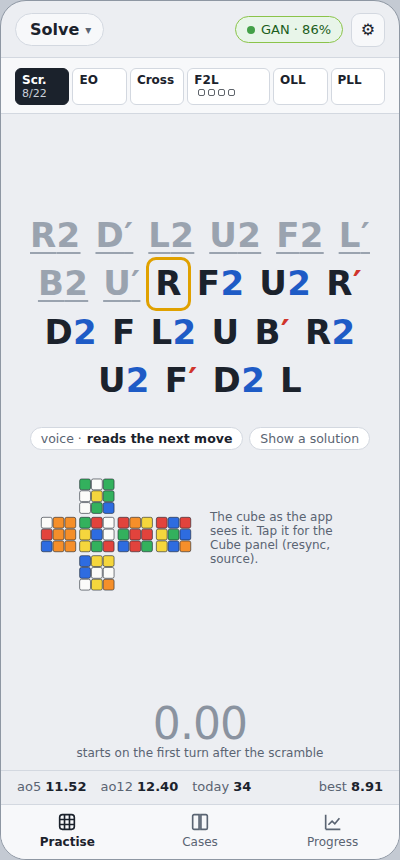 | 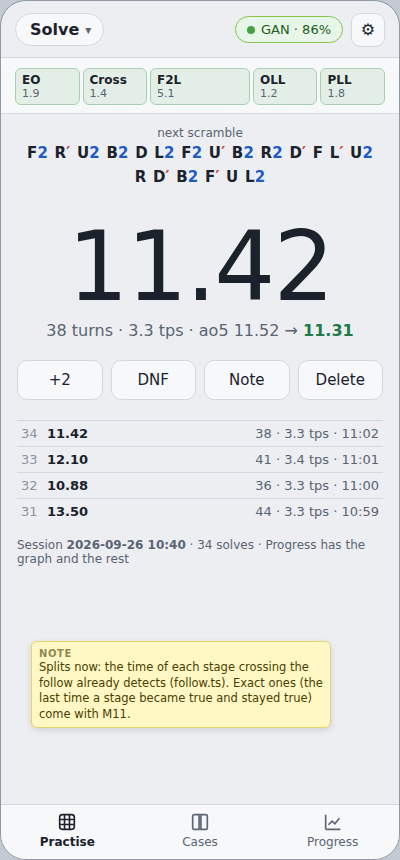 | 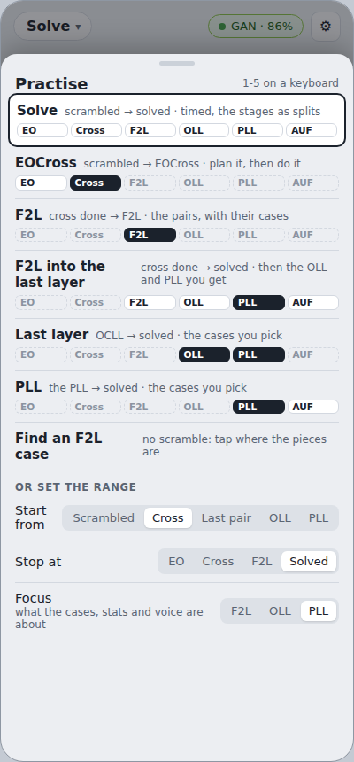 |

| P4 PLL, case on the cube | P5 PLL, solved | P6 PLL setup |
|---|---|---|
| 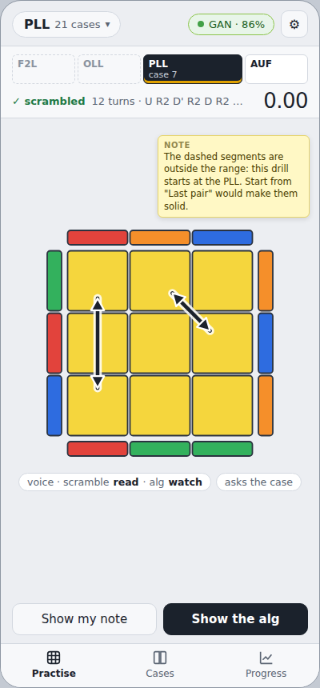 | 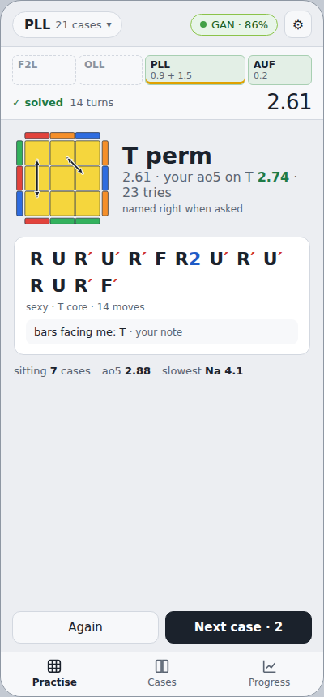 | 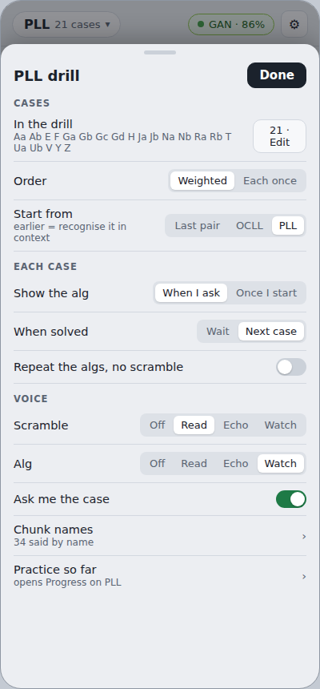 |

| P7 F2L practice | P8 F2L, find a case | P9 The cube pill |
|---|---|---|
| 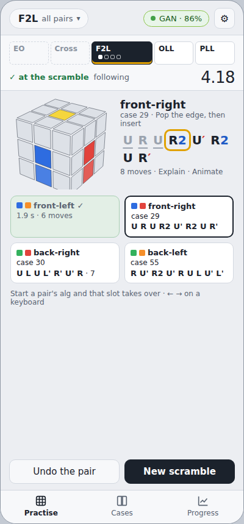 | 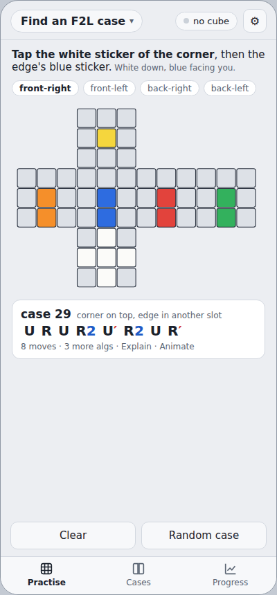 | 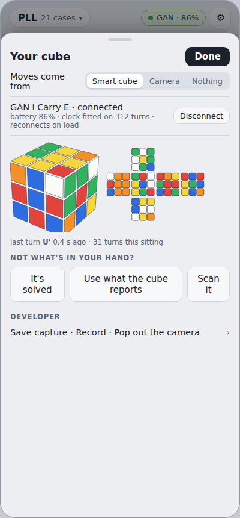 |

D1, desktop Solve with the coach on, mid-solve:

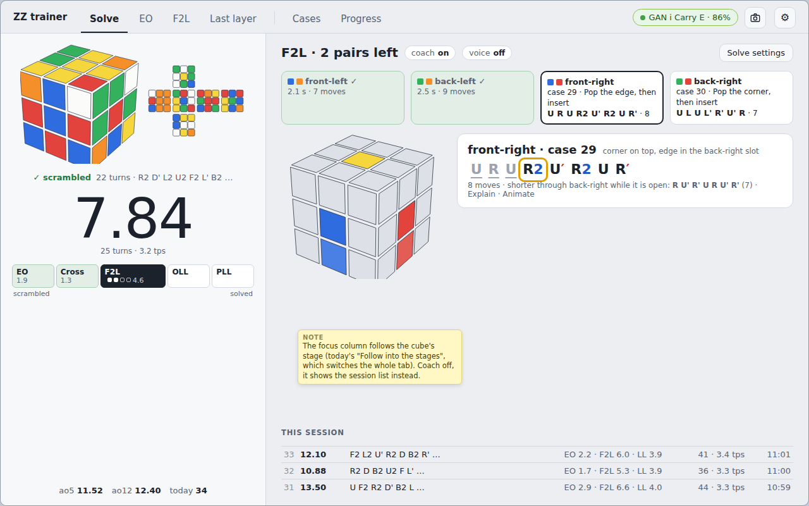

D2, desktop PLL drill with the Cases drawer open:

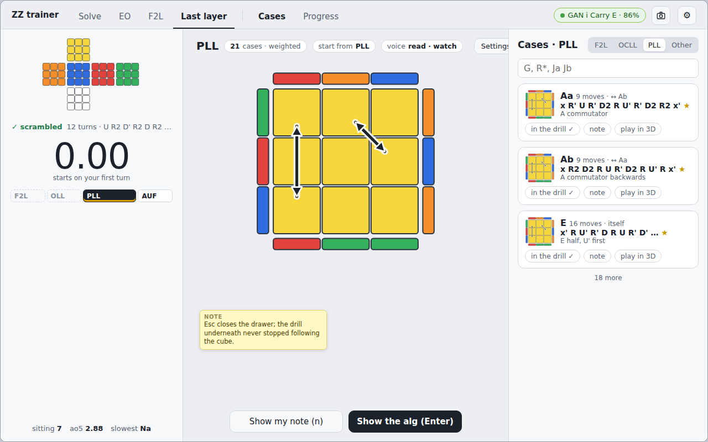

The same screens today, with a replayed smart cube:

| PLL, phone | F2L, phone (the whole page) | Solve, mid-solve |
|---|---|---|
| 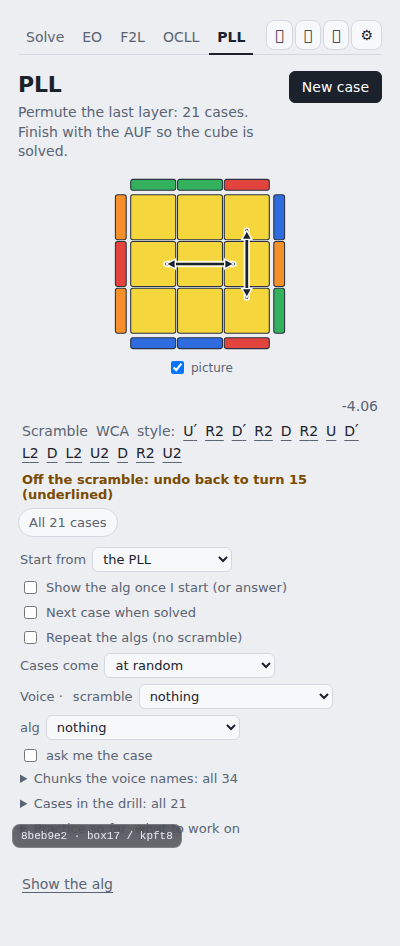 | 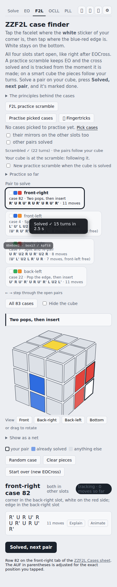 | 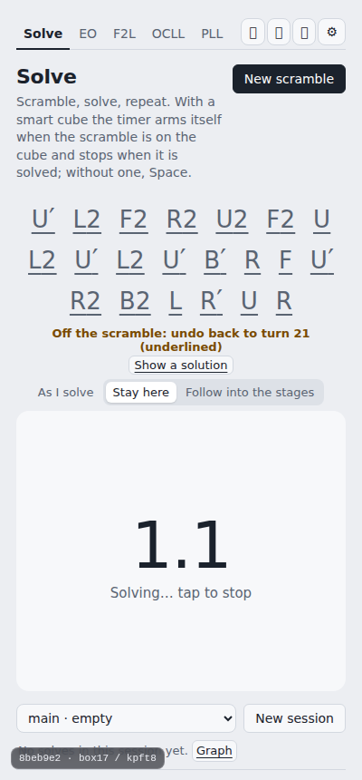 |

---

## 1. How the app is used

The evidence is the code, the commit log since 2026-09-16, the
`(user, ...)` decisions in comments, `docs/smart-cube-design.md` and
the LL drill's design rules.

| Posture | Where the phone is | Input | What the screen must do | Evidence |
|---|---|---|---|---|
| **Propped** (most drilling and timing) | Standing on the desk, about an arm's length away. Hands on the smart cube. | The cube's turns, the voice (read/echo/watch, "ask me the case"), sounds | Be readable at a glance from about 60 cm. One thing big. Never need a tap mid-attempt. | The LL drill's rules ("eyes on the cube", quiet UI, no timer buttons); the Solve tab's "phone out of reach"; beeps; keep-awake; the voice modes |
| **In hand** (between sets) | In hand | Touch | Choose what to practise, change the pool, read an alg, write a note, look at the numbers | Case sheet stars and notes; the practice tables; the session picker |
| **At the desk** | Desktop Chrome on the Windows box, webcam on | Mouse, keyboard (Dvorak-friendly keys), cube | Room for the cube and the thing at once; long reading (principles, explanations); the recording rig | `@media (min-width:1600px) zoom`; the scan sheet's three-column layout; the Record button; the F2L principles |
| **No smart cube** | Either | Space / tap timer, typed moves (EO), tapping the pieces (F2L finder), the camera | Every mode still works: "nothing may work *only* with the cube" (smart-cube-design 0) | `MoveSource`; the EO moves box; the F2L tap finder; the scanner |

Two consequences run through everything below:

- The **propped** posture is the one the app is used in most, and the
  one the current layout serves worst on a phone. The thing you need
  at a distance is often small: the PLL timer is 14 px grey text. The
  thing you reach for is at the bottom of a long scroll: "Show the
  alg" sits under about a dozen drill options.
- The **in-hand** and **desk** postures need the options, the tables
  and the reading. They are why the options exist, so the options must
  not be deleted, only moved.

---

## 2. The critical user journeys

Frequency is judged from the commit history: how much work and how
many fixes each journey has attracted.

| # | Journey | Posture | How often | Today's path | Friction |
|---|---|---|---|---|---|
| 1 | **Timed solves** (the csTimer replacement): the scramble, followed on the cube, arms, the first turn starts, solved stops, the next scramble appears | Propped | Daily | Solve tab | Mostly good. But: a permanent blurb; "Press here (or Space)…" shown with a cube; **an amber "Off the scramble: undo back to turn 21" on every timed solve** (verified, `now-phone-solve-timing.png`); the cube's state is only visible in a modal; no splits |
| 2 | **Timed solve with the coach**: as the cube crosses into EO, F2L, OLL and PLL, that stage's help shows (pair cards, the case) | Propped | Often (the default is "Follow into the stages") | Solve tab + "Follow into the stages" + Settings → "Follow my solve…" | The whole tab switches under you mid-solve, and each tab has a different layout. **The Solve timer's running total is visible nowhere** while the drill tabs are up (they run their own stage timers). Drill attempts may be filed along the way. |
| 3 | **A stage range**: start with the cross done, do F2L with help, carry on into OLL/PLL, then the next F2L scramble | Propped | Asked for ("start in F2L and then follow it and practise PLL") | F2L tab → "F2L practice scramble" + F2L's "New practice scramble when the cube is solved" + Settings → follow on + the OCLL and PLL tabs' own settings | Four controls on three screens, and no single place that says "this is what I am practising". The OCLL and PLL tabs arm on the way through as if each were its own drill. |
| 4 | **Drill last-layer cases**: pick a pool, scramble to a case, recognise, execute, see the per-case numbers; variants: start earlier, repeat mode, the quiz, cycle order | Propped (run), in hand (setup) | Daily during 09-21..09-24 | OCLL / PLL tab | About a dozen options sit between the case picture and "Show the alg" on a phone. The timer is 14 px. The voice is set here but set elsewhere for the Solve tab. The Fingertricks sheet can't be reached from these tabs. |
| 5 | **F2L, guided**: a practice scramble with EOCross solved; the pair cards name each slot's case and shortest alg as you go | Propped | Heavy work 09-25..26 | F2L tab | The page is about 2000 px tall on a phone (`now-phone-f2l.png`). About twelve blocks sit above the cube, including tap-mode instructions that don't apply. "Solved, next pair" is shown even when the cube advances by itself. |
| 6 | **F2L, targeted**: cases picked in the case sheet, put on a pair, timed, and a practice table | Propped + in hand | New (09-26) | F2L tab: "Practise picked cases", the picked line, two checkboxes, "Practice so far" | Shown in every F2L mode, even with nothing picked. The pool is picked in the case sheet here but inside the drill for last-layer cases. |
| 7 | **F2L, find a case**: "my pair is here, what's the alg?" by tapping the pieces on the picture | In hand / desk, often no smart cube | Occasional | F2L tab, the same page as 5 and 6 | Its instructions lead the page. Its controls (Random case, Clear pieces, the legend, the views) stay live while a cube is being tracked. |
| 8 | **EO / EOCross planning** | Propped / in hand | Earlier heavy use, now occasional | EO tab + Settings → EO trainer | The EO settings are in the global Settings sheet, while the last-layer settings sit on their tab. The moves box, Check and Start timer show with a smart cube. There is no scramble tracking or voice on this tab. |
| 9 | **Look something up**: an alg, a case, another puzzle, fingertricks | In hand / desk | Often | "All 21 cases" chip; "All 83 cases" button; the header's Algs (which also holds the 3x3 last layer, in a different card design); Fingertricks buttons on EO and F2L only | Five entry points. The sheets are modals, so you can't read a case sheet while the drill waits. |
| 10 | **See progress** | In hand / desk | Weekly? | The Solve tab's stats line + Graph (Stats sheet); PLL/OCLL "Practice so far" fold; F2L "Practice so far" fold | Three places, three designs, no overview. |
| 11 | **Keep the cube honest**: connect, reconnect, resync, battery, a miscalibrated cube | In hand | Every sitting | The Cube button (colour = status) → Cube sheet; "Reconnect on load" lives there, but "Follow my solve" and "Colour facing you" live in Settings | The live belief (the one thing that tells you the app thinks something odd) is only in the modal. The resync actions have two wordings. |
| 12 | **Scan with the camera** (no smart cube) and camera follow | In hand | Rare since the smart cube arrived | Scan (c) → the scan sheet → docks on lock | The sheet is the vision pipeline's debug console: Moves/Record fixture row, Pause, Save frame, pause on lock, Pipeline, Debug controls. Faces are named by letter. The lock result is closed or docked away before you can read it. |
| 13 | **Record training data** | Desk | Occasional | Header Record (dev server only) + the scan sheet's own Record row (on the deployed site too) | Two Record controls. The developer one leaks onto the deployed page. |
| 14 | **Settings, sync, history** | In hand | Rare | Settings sheet | The "Timer" section holds keep-awake, sync and history. The EO trainer's settings are a section here; the last-layer settings are not. |

Journeys 1-6 are the product. Journeys 9-11 support them. Journeys
12-14 are for tooling and administration. The redesign should make
1-6 calm, and 9-11 one tap away.

---

## 3. What makes it cluttered

### 3.1 Five tabs draw the same three things five ways

| | Solve | EO | F2L | OCLL | PLL |
|---|---|---|---|---|---|
| **Scramble** | Huge, bold, tracked, no label | "Scramble:" plain text, **not tracked** | Small, tracked, folds to "Scrambled ✓ (N turns)" | "Scramble WCA style:", tracked | same as OCLL |
| **Cube picture** | none | 3D (or net, in Settings); Peek back / Reset view | 3D with tap-to-place; View Front/Back-right/Back-left/Bottom; "Show as a net"; "Hide the cube" | 3D **and** the diagram | the diagram only; a "picture" tick |
| **Timer** | 72 px pad | 30 px, beside the bad-edge count | none (times in toasts) | 14 px grey | 14 px grey |
| **"New"** | New scramble | New scramble | F2L practice scramble / Practise picked cases / Random case / Start over (new EOCross) | New case (Next alg) | New case (Next alg) |
| **Settings live** | Settings sheet + "As I solve" inline | Settings sheet | Settings sheet + inline | inline | inline |
| **Next when done** | "Next scramble by itself" (Settings) | none | "New practice scramble when the cube is solved" | "Next case when solved" | same |
| **Voice** | Settings → "Scramble voice" (Off / Reads the next move / …) | none | none | inline, two selects (nothing / reads me the next move / …) | same |
| **Reveal** | Show a solution | Show optimal EO solutions | always shown | Show the alg | Show the alg |
| **Space** | press arms, release starts | toggles on press | nothing | toggles on press | toggles on press |

Every row of this table is something your eye must relearn on each
switch, and the follow switches tabs *during a solve*, which is the
worst moment to relearn anything.

### 3.2 The setup lives on the practice surface

- **PLL on a phone** (`now-phone-pll.png`): case picture, scramble,
  then Start from, Show the alg once I start, Next case when solved,
  Repeat the algs, Cases come, Voice scramble, Voice alg, ask me the
  case, Chunks, Cases in the drill, Practice so far. Only then comes
  "Show the alg". These are good options, all of them set once per
  sitting and none of them touched mid-case.
- **F2L on a phone** (`now-phone-f2l.png`): heading, two intro
  paragraphs, the principles, three buttons, the picked-cases line and
  two checkboxes, the scramble, a status line, the auto-next box,
  Practice so far, and the pair cards, all above the cube. Below the
  cube come the view buttons, the net, the legend, three tap-mode
  buttons, and only then the alg.

### 3.3 One question asked in six places

"When this attempt ends, what happens? Where does the next one start?"

- **Follow** (three controls): Settings → "Follow my solve on the smart
  cube"; the Solve tab's "As I solve: Stay here / Follow into the
  stages"; the scanner's "follow my solve". The camera follow ignores
  the Solve tab's choice.
- **Where it starts**: the last-layer "Start from"; the F2L "F2L
  practice scramble" vs "Practise picked cases".
- **Next** (three wordings): "Next scramble by itself", "New practice
  scramble when the cube is solved", "Next case when solved".
- **Carry on** (three buttons): "Continue to F2L with this cube",
  "Continue to OCLL with this cube", "Continue to PLL with this cube".
  They are styled differently, and with the follow on (the default) the
  follow usually moves you before you see them.

### 3.4 The follow swaps the whole screen

Today a followed solve is carried by switching tabs: the Solve tab
pins itself and keeps the timer running underneath, but it cannot be
seen. You get four layouts in one solve and four toasts, and the drill
tabs arm and time their own stage. It works, and it is the right idea
(help for the stage you are in). But it is expressed as navigation,
when it should be expressed as content inside a stable frame.

### 3.5 The cube itself is hidden

What the app believes your cube looks like is only in the Cube sheet
modal. Each tab's picture is a picture of the *case*, which is right
for the drill but useless for "why is it calling my turn wrong?". The
memory file on smart-cube quirks has the tell for a miscalibrated
cube, "the scramble's underline not ticking along", which is exactly
the kind of thing a small always-visible net would show at once.

### 3.6 Prose is permanent

- Every tab opens with one to five lines of explanation. F2L has two
  paragraphs: nine lines on a phone.
- Sheet headers carry paragraphs too. The Cube sheet's header is six
  lines on a phone.
- Explanations are right the first time and noise the five-hundredth.

### 3.7 Lookup and progress are scattered

- **Cases**: two different buttons inside tabs, plus the header's
  Algs, which duplicates the 3x3 last layer in another card design.
- **Fingertricks**: from EO and F2L, not from OCLL/PLL, where the
  chunk names it defines are used.
- **Progress**: in three places with three designs.
- All of them are modals over a dimmed page.

### 3.8 Developer tools in the user surface

- The scan sheet is the vision debug console. Its Moves/Record fixture
  row and Save frame are live on the deployed site.
- The version chip sits over content at the bottom left of every phone
  screenshot: it covers the F2L pair cards and the Solve tab's stats.

### 3.9 Desktop

- Column widths differ by tab: Solve about 720 px, F2L 900, EO and PLL
  about 1140, the tab bar 900.
- The PLL tab's case picture is a 180 px diagram in a 340 px column on
  a 1280 px screen (`now-desk-pll.png`), and the right column is
  options.
- On F2L the cube sits beside a narrow result column, under a header of
  buttons and prose (`now-desk-f2l.png`).
- The sheets that would pair naturally with a drill (the case sheet,
  the stats) are modals.

---

## 4. Bugs found along the way

Two were **verified** by a headless replay or a screenshot. The rest
come from reading the code and should be checked before fixing. All of
them, with file:line references, are in `findings.md`.

- **Verified:** during every timed smart-cube solve on the Solve tab,
  the track line turns amber and reads "Off the scramble: undo back to
  turn N (underlined)" (`now-phone-solve-timing.png`). The scramble
  tracker keeps judging after the cube has armed. The same happens on
  PLL while you do the alg (`now-phone-pll.png`).
- **Verified:** on a phone the version chip overlaps content on every
  tab.
- **From reading the code:**
  - **F2L's scramble instruction is erased at once.** "Apply this to a
    solved cube held white on top…" is overwritten by "Tracking your
    cube…" in the same call.
  - **The Solve tab takes every tab's share.** A PLL case's setup
    becomes the Solve tab's scramble and can be timed into the 3x3
    session. Receiving a share also resets a manual attempt in
    progress.
  - **Escape does two things when the scanner is docked.** It closes
    the scanner and also discards a running Solve-tab solve, without
    asking.
  - **Drill attempts may be filed during a carried solve.** Only the
    voice and the quiz check `carriedSolve()`.
  - **Fingertricks can't be reached from OCLL/PLL,** because quiet
    mode hides its button.
  - **The OCLL quiz can't hear the names of its own cases.** The
    speech parser has no words for Sune, Anti-Sune, Pi or L.
  - **"Start over (new EOCross)" makes no EOCross** and leaves the old
    scramble line up.
  - **The scanner's lock button always says "Practice in the EO
    trainer",** whatever stage the lock routes to.
  - **"↩ Resume" never hides** once shown.
  - **The Settings sheet's key list promises "n new, Space timer" on
    every stage;** F2L has neither. EO's `m` key is documented nowhere.

---

## 5. Principles

These extend the rules the LL drill already settled (quiet UI, a voice
mode per move set, chunk names short enough to say, new features
default to quiet) to the whole app.

1. **The cube and the thing.** Every mode has the same frame: the cube
   rail, then the focus pane. The rail never changes shape between
   modes. Only its contents' emphasis does.
2. **Run vs setup.** If you would not touch it mid-attempt, it lives in
   the mode's setup sheet. The run view has at most two buttons, at
   thumb height.
3. **A mode is a range.** A mode has a start stage (what the scramble
   leaves), a stop stage (when the attempt is over), a focus (what the
   cases, stats and voice are about) and a "when it ends" (next or
   wait). Every follow, start-from, continue and next-when-solved
   control is one of these four.
4. **One hero at a time on a phone, chosen by the phase.** Scrambling
   shows the scramble; armed or solving shows the case (drills) or the
   timer (Solve); done shows the result. The phone never asks for a
   tap to show you the next thing.
5. **Same event, same place, same word.** A result appears in the same
   spot in every mode. "New" is always the same button (n). The voice
   modes have one wording.
6. **Say it once.** Explanations go into a "?" per mode and into the
   case sheets. A first run can show the "?" open.
7. **Nothing only with the cube.** Every run view has a no-cube form:
   a tap/Space timer, typed moves, tapping the pieces. It appears when
   the source is "Nothing" and hides otherwise.
8. **Developer tools are a mode, not a garnish.** One switch in
   Settings shows them. The deployed page shows none by default.
9. **Keep what works:** WCA shown and typed, the trainer frame worked
   in, the Dvorak keys, the shared scramble between modes, favourites
   and notes, the voice's behaviour, auto-connect.

---

## 6. The proposal

### 6.1 The attempt model: the stage strip

```
 [scramble]  EO   Cross   F2L ▪▪▫▫   OLL   PLL   AUF
             ╰──────────── range ───────────────╯
```

A mode is `start` + `stop` + `focus` + `when it ends`:

| Preset (today's tab) | start (what the scramble leaves) | stop | focus | today's equivalent |
|---|---|---|---|---|
| **Solve** | scrambled | solved | the time (the stages as splits) | Solve tab |
| **Solve, coach on** | scrambled | solved | each stage's help as the cube reaches it | Solve + "Follow into the stages" |
| **EO / EOCross** | scrambled | EO, or EOCross | the plan (hints, optimal) | EO tab + its Goal setting |
| **F2L** | cross done | F2L done | the pairs | F2L "practice scramble" |
| **F2L, picked cases** | cross done, a picked case on a pair | that pair | the picked cases | "Practise picked cases" |
| **F2L into the last layer** | cross done | solved | F2L, then the OLL/PLL you get | F2L + auto-next + follow + OCLL/PLL tabs (journey 3) |
| **Last layer** | OCLL case | solved | OCLL and PLL | OCLL + "Continue to PLL" |
| **PLL** | PLL case (or last pair / OCLL, for recognition) | solved | PLL | PLL tab + "Start from" |
| **Find an F2L case** | – (no scramble) | – | the tapped case | F2L tap mode |

What already exists for this:

- **Start states:** random-state scrambles (Solve); the EOCross-solved
  practice scramble and the targeted pair scramble (F2L); the
  last-layer case scrambles and the "start from" setups (LL).
- **Stop conditions:** `stage.ts` reads the stage off a facelet
  string; each drill's `check`.
- **Stage crossings:** the follow already detects each one on the turn
  it happens (`follow.ts`'s mark). So the strip can show split times
  now, as approximate first-crossings, before M11's "last time it
  became true and stayed true" definition lands.

What changes:

- **The follow switches the focus pane, not the tab.** The rail (with
  the timer) never moves. During a Solve with the coach on, the stage
  helpers are read-only: no drill attempt is filed, and the times
  become the Solve's splits.
- **One "When it ends" per mode** (next / wait) replaces the three
  auto-next controls. It is shown in the result as a countdown ("Next
  case · 2"), so it can be cancelled.
- **A hand-scrambled cube picked up after the 15 s rest** no longer
  switches mode. The rail says "Following your cube: F2L", the focus
  shows the F2L helper, and one button offers "Practise from here".
  Today's automatic switch to the stage's tab (with the rule that it
  lands on Solve at the end) becomes unnecessary.
- **Custom ranges** ("Start from" / "Stop at" / "Focus" under the
  presets, mockup P3) are for the rare combination the presets don't
  cover. The presets are what you tap.

### 6.2 The screen: the cube rail and the focus pane

**Desktop (mockups D1, D2).**

- **Rail:** a left column of about 420 px (330 px when the focus is a
  case picture). From the top:
  - the live cube, 3D and net side by side;
  - the scramble, big while you apply it and folded to one line once
    it is on the cube;
  - the timer, large;
  - the stage strip, with the splits under it;
  - the session's ao5 / ao12 at the foot.
- **Focus pane:** the rest of the width, with a header row holding the
  mode, summary chips (for example "21 cases · weighted", "start from
  PLL", "voice read · watch") and a Settings button.
- **Wide screens:** past about 1600 px a third column can hold the
  Cases drawer open (D2). Below that, the drawer slides over the focus
  pane and Esc closes it, and the drill underneath keeps following the
  cube.

**Phone (mockups P1-P9).**

- **The rail is a strip** under the top bar: the stage strip, the
  folded scramble line and the timer on the right.
- **The hero area follows the phase:**
  - Scrambling: the scramble at 34 px bold, with the next turn boxed
    and the net underneath (P1).
  - Case on the cube: the diagram at 300 px (P4).
  - Solving a Solve: the timer at 96 px.
  - Done: the result (P2, P5).
- **At the bottom, at thumb height:** at most two buttons, and a
  three-item nav under them.

On your question whether the desktop should get a fancier UI than the
phone: **the same grammar, different density.** A separate phone UI
and desktop UI would double the maintenance of a single-developer app.
Its real benefit is that the desktop shows both panes at once while
the phone shows one hero at a time, and one layout with two breakpoints
gets exactly that. Section 8 has the alternatives.

### 6.3 Navigation

| | Phone | Desktop |
|---|---|---|
| Modes | the **mode chip** at top left ("PLL 21 cases ▾") opens the picker (P3); keys 1-5 | tabs: Solve · EO · F2L · Last layer, plus the chip's ▾ for the other presets |
| Cases, Progress | a bottom nav: Practise · Cases · Progress | tabs after a divider; Cases also as a drawer |
| The cube | the **cube pill** ("● GAN · 86%": green on, spinning while reconnecting, amber when out of sync) opens the cube panel (P9) | the same pill, plus a camera button |
| Settings | the gear; it carries a dot when sync needs attention (today's ⚠ chip) | the same |

- **Keys kept:** c (camera), l (cube), a (Cases → other puzzles), s,
  n, Space, Esc.
- **Keys added:** 1-5 (modes), ? (the mode's help), Enter ("Show the
  alg"), h (the note hint).

### 6.4 The cube rail in detail

- **Source.** The pill says where moves come from:
  - smart cube: its name and battery;
  - camera: "Camera · following";
  - nothing: "No cube", with a grey dot.

  The panel (P9) holds everything the Cube sheet, the Scan/Resume
  buttons and the Record button do today:
  - connect / disconnect and reconnect-on-load;
  - the live 3D cube and net;
  - the resync actions, worded once: "It's solved", "Use what the cube
    reports", "Scan it";
  - a Developer row: save capture, record, pop out the camera.
- **The live cube.** One view control per rail: 3D / net / hidden.
  - It replaces EO's Peek back / Reset view and 3D/Net setting, F2L's
    View buttons and "Show as a net", F2L's "Hide the cube", and the
    last layer's "picture" tick (the diagram is the focus pane's
    business, not the rail's).
  - The defaults per mode keep the settled decisions:
    - PLL: hidden, because the diagram is the case (2026-09-23).
    - The quiz: hidden until the case is answered, like the diagram
      (2026-09-22).
  - What it shows depends on the mode:
    - the scramble's state when there is no cube;
    - the belief when there is one;
    - EO's bad-edge marks when that setting is on;
    - F2L's greyed pieces in the Find mode.
- **The scramble.**
  - While you apply it:
    - it is the hero on a phone;
    - done turns are grey and underlined, and the next turn is boxed;
    - the voice reads it as today.
  - **A wrong turn replaces the scramble with the undo, in big type**
    ("undo U′ R′"), with an amber strip. That is readable at arm's
    length, where today's 13 px amber line is not.
  - Once armed it folds to "✓ scrambled · 22 turns · R2 D′ …", and it
    stops being judged (fixing the verified bug in section 4).
  - The scramble's ⋯ menu holds Show a solution, Fingertricks, New
    scramble and "hold: white down, blue front" (the trainer hold,
    once, where every tab now explains it differently).
- **The timer.** It is always in the same spot: the right end of the
  strip on a phone, under the scramble on desktop. Its size depends on
  the mode (the hero in Solve, secondary in drills). With source
  "Nothing" the hero area becomes the press pad, as today.
- **Space: one behaviour everywhere.** Recommended: the Solve tab's
  (press arms, release starts, press stops). Section 10.
- **The stage strip.**
  - Idle: segments outside the range are dashed; the focus stage has
    an amber underline.
  - Running: the current segment is dark and F2L shows four pips.
  - Done: each segment shows its split, and the drills show
    recognition + execution in theirs (P5).

### 6.5 The focus pane per mode

- **Solve** (P1, P2, D1).
  - Coach off: the session list (desktop) or the last four times
    under the result (phone).
  - Coach on: each stage's helper as the cube reaches it (the F2L
    pair cards, then the OCLL case, then the PLL case), read-only.
  - The result, always in the same spot: time, turns, tps, the ao5
    change, and +2 / DNF / Note / Delete.
  - The session picker and New session move to Progress; the current
    session is a chip.
- **EO / EOCross.**
  - Before the attempt: the hint chips (bad edges, move count, F/B
    plan, strategy) and "Strategy for this scramble".
  - After it: your moves against optimal and the optimal list, which
    is the current "Show optimal EO solutions" content, shown as the
    result.
  - The moves box, Check and Clear appear only with source "Nothing".
  - "Continue to F2L" becomes the range: pick "EOCross → F2L" and it
    carries on.
- **F2L** (P7).
  - The pair being done: its name, case, alg with progress, Explain
    and Animate.
  - The four pair cards, with ← → to step.
  - "Undo the pair" and "New scramble" at the bottom.
  - "Did this" and "Solved, next pair" appear only with source
    "Nothing".
  - The principles move to Cases → F2L.
- **Find an F2L case** (P8): its own preset.
  - The instruction line, the four slot chips, the tappable net or 3D
    view, and the answer card; Clear and Random case at the bottom.
  - This is today's tap finder with nothing else on the page, and it
    doesn't need a cube.
- **Last layer / PLL / OCLL** (P4, P5, D2).
  - The case diagram is the hero.
  - "Show my note" and "Show the alg" are the two buttons.
  - The result block: the case named, your time against your ao5 on
    that case and the try count, the alg you did with its chunk labels,
    your note, and "Again" / "Next case · 2".
  - The cycle counter and "case 7 of the sitting" go in the strip.
  - Repeat mode keeps its behaviour. It is a setting in the setup
    sheet, and the rail's scramble line reads "repeating: from wherever
    the cube is".

### 6.6 Setup sheets

- **Opening:** from the mode chip's ⋯ on a phone, or the focus
  header's Settings button on desktop. On desktop it is a panel, on a
  phone a bottom sheet (P6).
- **Contents:** every option that lives on the tab or in the global
  Settings sheet today, grouped by what it is about (Cases, Each case,
  Voice, When it ends). The complete mapping is in section 7.
- **Voice:** the same two rows (scramble, alg) in every mode that has
  a voice. The Solve mode's is just the scramble row, and it moves
  here from Settings → Timer.
- **Wording:** one set of labels, Off / Read / Echo / Watch, with the
  long form as the sub-line.

### 6.7 Cases (the library)

- **One destination.** Tabs: **F2L · OCLL · PLL · Other puzzles ·
  Fingertricks.** The F2L principles become the head of the F2L tab.
- **One card design** (today's `ui/refsheet.ts` scaffold, already
  shared by the last-layer and F2L sheets):
  - the picture and the alg with chunk labels;
  - a star on each alg;
  - the note;
  - "play in 3D";
  - and a **Practise toggle on every case**. This unifies the pool:
    today F2L picks its pool in the sheet and the last layer picks in
    the drill. Section 10 asks which way.
- **Dropped:** the 3x3 last-layer entry in Other puzzles, since
  OCLL/PLL live here.
- **Where it opens:** a drawer over the drill on desktop, a page on
  the phone. "Drill this case" / "Set in finder" stay on each card.

### 6.8 Progress

One destination:

- **Solves:** the graph, the sessions (picker, rename, New session),
  history import / export, and later M11's phase medians.
- **Last layer:** the per-case table and graph with the "drill the
  five to work on" buttons, i.e. today's PLL/OCLL "Practice so far".
- **F2L:** the same, for picked cases.
- Later, **EO:** planning attempts.

The run screen keeps only a one-line summary (ao5 / ao12 / today, or
the sitting's cases).

### 6.9 The scanner and the developer tools

- **The end-user scan view:**
  - the camera and the hint banner;
  - the six evidence bars, named by **colour** (today they read "U
    white", which runs against the project's "say colours" rule);
  - the lock, with "hold the white centre on top…" and where it is
    taking you.
- **After a lock:**
  - On desktop the camera lives in the rail, where the 3D cube would
    be, and following is just the rail with a camera source.
  - On a phone it docks into the strip as a thumbnail.
- **Everything else goes to Settings → Developer:** Moves/Record,
  Pause, Save frame, pause on lock, Pipeline, Debug controls, Capture
  debug, the raw facelets and the certificate line. Turning it on
  shows them in place.
- **The version chip** moves to Settings → About. The update toast
  stays.

---

## 7. Where every current control goes

The same inventory at file:line level is in `findings.md`.

**Header.** Tabs → the mode chip / desktop tabs · Scan (c), Resume (r),
Cube (l) → the cube pill / camera (keys kept) · Algs (a) → Cases →
Other puzzles · Record, ⧉ → cube panel → Developer · Sync chip → a dot
on the gear · Settings (s) → the gear.

**Solve tab.**

| Control | New home |
|---|---|
| Title and blurb | the "?" |
| New scramble | the rail's scramble ⋯ and n |
| Scramble and track line | the rail |
| Show a solution | the scramble ⋯ |
| As I solve: Stay here / Follow into the stages | Solve setup: "Coach: show each stage's help" |
| The timer pad | the rail timer (the pad with source "Nothing") |
| OK / +2 / DNF / Delete | the result block |
| Session select, New session | Progress → Solves (the current session as a chip) |
| Stats line | the rail foot |
| Graph | Progress → Solves |
| Solve list, Show all | the focus pane (desktop) / Progress |

**Settings → Timer.**

| Control | New home |
|---|---|
| Next scramble by itself | Solve setup: "When it ends" |
| Sounds | Settings → General, for every mode (today only the Solve tab beeps) |
| Scramble voice | Solve setup → Voice |
| Keep the screen awake | Settings → General |
| Sync times | Settings → Account |
| History import/export | Progress → Solves → ⋯ |

**Settings → Cube.**

| Control | New home |
|---|---|
| Colour facing you | stays |
| Follow my solve on the smart cube | gone: the range model and the coach toggle replace it |

**Settings → EO trainer, → F2L, → Tools.**

| Control | New home |
|---|---|
| EO trainer section | EO setup |
| F2L section | F2L setup |
| Labeler | Settings → Developer |

**EO tab.**

| Control | New home |
|---|---|
| Title and blurb | the "?" |
| The hold paragraph | the scramble ⋯ ("hold") |
| 3D cube, Peek back, Reset view | the rail's live cube |
| Timer, Start timer / Reset | the rail timer |
| Hint and strategy chips | focus, before the attempt |
| Moves box, Check, Clear | focus, source "Nothing" only |
| Fingertricks | the scramble ⋯ |
| Show optimal EO solutions | the result block |
| Continue to F2L | the range, or "Carry on" in the result |
| The `m` key | kept, and documented |

**F2L tab.**

| Control | New home |
|---|---|
| Heading, intro paragraph 1 | the Find preset |
| Intro paragraph 2 | gone |
| The principles | Cases → F2L |
| F2L practice scramble | F2L's New (the rail) |
| Practise picked cases | the F2L picked-cases preset |
| Picked line, mirrors, other pairs solved | F2L setup → Cases |
| Fingertricks | the scramble ⋯ |
| Scramble line and message | the rail (instructions in the "?", errors as the rail's status) |
| New practice scramble when solved | F2L setup: "When it ends" |
| Practice so far | Progress → F2L |
| Pair chips/cards | focus |
| All 83 cases | Cases → F2L (drawer) |
| Hide the cube, View buttons, Show as a net | the rail's view control |
| Hint box | the pair card's explanation head (toggle in F2L setup) |
| Tap-to-place, legend, Random case, Clear pieces | the Find preset |
| Start over (new EOCross) | gone (New scramble; Clear in Find) |
| Result pane | focus |
| Did this, Solved next pair | source "Nothing" only |
| The footer ("Row N… the position you tapped") | the case card in Cases |
| Show advanced algs | F2L setup |

**OCLL / PLL tabs.**

| Control | New home |
|---|---|
| Title and blurb | the "?" |
| New case / Next alg | the rail and n |
| 3D cube (OCLL; PLL started early) | the rail's live cube |
| The diagram | the focus hero |
| The "picture" tick | LL setup: "Show the case: diagram / nothing" |
| Case line, cycle counter | the strip |
| Timer, scramble, track | the rail |
| All N cases | Cases (drawer) |
| Start from | LL setup (the range's start) |
| Show the alg once I start | LL setup: "Show the alg: when I ask / once I start" |
| Next case when solved | LL setup: "When it ends" |
| Repeat the algs | LL setup |
| Cases come | LL setup: "Order" |
| Voice scramble / alg, ask me the case | LL setup → Voice |
| Chunks the voice names, What to say | Voice sub-pages |
| Cases in the drill | LL setup → Cases, a summary and Edit (the pool; section 10) |
| Practice so far | Progress → Last layer |
| Result / alg panel | the result block |
| Show my note, Show the alg | the bottom bar |
| Session line | the rail foot |

**Sheets.**

| Sheet | New home |
|---|---|
| Cube sheet | the cube panel |
| Scan sheet | the camera source (dev rows → Developer) |
| Algs sheet | Cases → Other puzzles |
| Stats sheet | Progress → Solves |
| Fingertricks | Cases → Fingertricks, plus the ⋯ on any alg line or scramble (which also fixes OCLL/PLL) |
| Case sheets | Cases |
| Version chip | Settings → About |

---

## 8. Alternatives considered

1. **Keep the tabs and only trim** (phase 1 alone). This is cheap,
   and it removes most of the visual clutter. It does not fix the
   mid-solve tab swap, the invisible Solve timer, or the cross-stage
   practice (journeys 2 and 3). **Do it first anyway.**
2. **Separate UIs for phone and desktop:** a desktop "cockpit" and a
   phone "stage display". This is what you floated. The real
   difference between them is density, which two breakpoints of one
   layout handle. Two UIs would drift, as the five tabs have.
   **Rejected; the same grammar at two densities.**
3. **Swipe between a Cube screen and a Focus screen on the phone.**
   This is your "two screens". It works in the in-hand posture, but
   with both hands on a cube you can't swipe. The phase-driven hero
   gives the right screen without a touch. **Keep the swipe as a
   secondary gesture on the hero.**
4. **One magic "session" screen that follows whatever the cube does,
   with no modes.** Too implicit: the stats need to know what you were
   practising, and the voice needs to know what to say. **Rejected;
   the range makes the choice explicit and cheap.**
5. **A left sidebar nav on desktop.** It would cost about 200 px of
   the width the two panes need. **Rejected for now.**

---

## 9. How to get there

Sizes as in `docs/ll-drill-next-steps.md`: S / M / L = an hour / half
a day / a day. Every phase ends with something that runs on the phone.
The headless checks (`check:smart`, `check:ll`, `check:f2l`,
`check:practice`, `check:record`) are the net: most of them select by
element id, so **keep the ids when controls move**, or update the
checks in the same commit.

**Phase 0: the bugs (S each).**

- The track line stops judging once armed (Solve and the drills). This
  is the verified bug.
- The F2L instruction survives `applyScramble`.
- The Solve tab ignores shares while a drill case is up, or asks.
- Escape with a docked scanner no longer discards a solve.
- The version chip stops covering content.
- Fingertricks reachable from OCLL/PLL.

**Phase 1: run vs setup on today's tabs (M-L, a day).**

- A setup sheet per tab: last-layer options off the tab; EO and F2L
  settings out of the global sheet; the Solve tab's timer settings.
  (`ui/settings.ts`'s `persisted()` already makes this a move rather
  than a rewrite.)
- Blurbs behind "?".
- F2L split into its practice view and a Find view.
- Header: the cube pill replaces Scan, Resume and Cube; Algs becomes
  Cases; Record moves into the cube panel.
- Developer rows on the scan sheet behind a Settings toggle.

This alone takes the PLL tab on a phone from about a dozen options
above "Show the alg" to none.

**Phase 2: the cube rail (L, 2-3 days).**

- One component that every tab mounts: the source pill, the live cube
  with one view control, the scramble with tracking, the wrong-turn
  undo and the ⋯ menu, the timer, and the stage strip.
- It replaces:
  - `track-ui`'s three uses;
  - `drill.ts`'s timer row and the Solve tab's pad;
  - EO's picture and views;
  - F2L's views, net and hide toggle;
  - the last layer's 3D cube.
- It is fed by `app/sources.ts` (the active source, the driver's
  armed/timing state) and the belief. One Space behaviour.
- The desktop two-column shell. The phone strip and the phase-driven
  hero.

**Phase 3: the range model (L, 2 days).**

- Modes as start / stop / focus / when-it-ends.
- `cubefollow` moves the focus pane instead of the tab. The Solve
  timer is never hidden, and the stage helpers are read-only during a
  Solve.
- The three follow controls collapse into the coach toggle. The three
  next-when-solved controls become one. The Continue buttons become
  presets.
- Splits from the follow's crossings.
- The "F2L into the last layer" preset.
- The mode picker.

**Phase 4: Cases and Progress (M-L).**

- The Cases destination and the desktop drawer; the Practise toggle on
  every case card (one pool model).
- The Progress destination, collecting the Stats sheet and the two
  "Practice so far" folds.
- The 3x3 last layer dropped from Other puzzles.

---

## 10. Decisions for you

1. **Merge OCLL and PLL into one "Last layer" mode** (set: OCLL / PLL
   / both; start from: the case / OCLL / the last pair)? They are one
   module mounted twice already, and the range model treats them as
   one. *Recommended: yes.*
2. **Phone navigation: a bottom nav** (Practise / Cases / Progress)
   **or keep a top tab row?** The bottom nav costs about 56 px in the
   run view but puts the in-hand destinations under the thumb.
   *Recommended: the bottom nav.*
3. **Space: one behaviour everywhere,** the Solve tab's (press arms,
   release starts, press stops)? *Recommended: yes.*
4. **The pool: picked in the case sheet (F2L's way) or in the drill
   (the last layer's way)?** *Recommended: the case sheet, with a
   summary and Edit in the setup sheet.*
5. **A hand-scrambled cube picked up after 15 s: switch mode (today) or
   show the helper with "Practise from here"?** *Recommended: the
   helper.*
6. **Splits in the strip now, from the follow's crossings, or wait for
   M11?** *Recommended: now, labelled as approximate.*
7. **Is the camera scanner still an end-user feature,** or mostly the
   labelling instrument now that the smart cube is here? The answer
   decides how much of 6.9 is worth building.
8. **Does the coach default to on for Solve?** Today "Follow into the
   stages" is the default.
9. **Keep the version chip visible,** or only in Settings → About with
   the update toast?

---

## 11. What this did not do

- **No app code changed.** This document, `findings.md`, the mockups
  and the screenshots are the whole change.
- **Not tried on a real phone.** The phone frames are 400 x 860 in
  headless Chrome, and the smart cube was replayed, not real.
- **The mockups are static HTML** with the app's palette and its own
  SVG renders. The cube net in P1, D1 and P9 is drawn by a small
  script in the page, not by the app.
